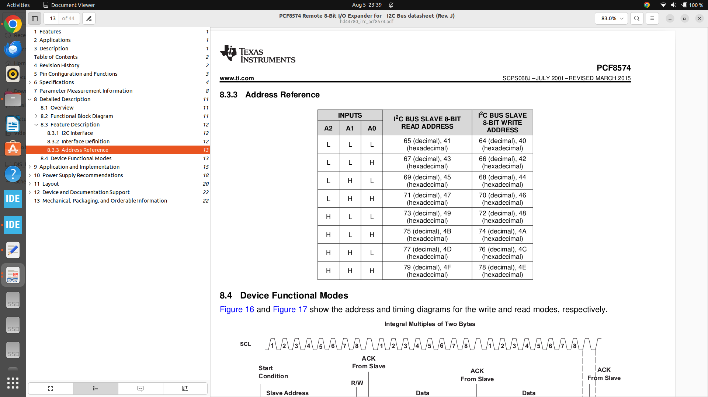
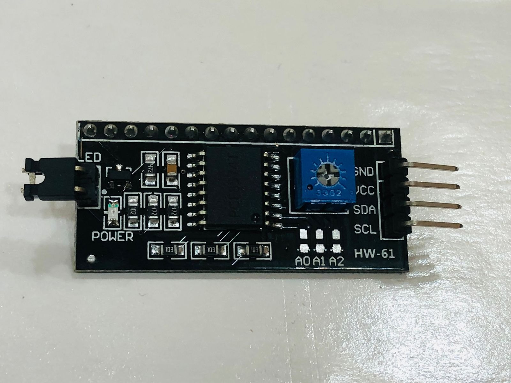

# 🧱 Bare-Metal I2C LCD Driver for STM32

This repository contains a lightweight, register-level I2C driver and LCD interface for STM32 microcontrollers. Designed without HAL or CMSIS abstraction, it provides full control over I2C communication and 4-bit LCD operation via PCF8574 I/O expander.

---

## 🚀 Features

- ✅ Bare-metal I2C implementation (no HAL)
- ✅ Manual GPIO configuration for PB8 (SCL) and PB9 (SDA)
- ✅ LCD initialization and control over I2C
- ✅ 4-bit LCD data transmission using PCF8574
- ✅ Support for multiple LCD slots (SLOT_1, SLOT_2, MAIN)
- ✅ LCD functions: clear, write byte, write string, set cursor
- ✅ Compatible with 16x2 I2C LCD modules

---

## 📂 File Structure

├── I2C.h / I2C.c # Bare-metal I2C driver 
├── LCD.h / LCD.c # LCD abstraction over I2C 
├── main.c # Demo program (optional) 
├── README.md # This file

## 🧩 Hardware Mapping

| Signal | STM32 Pin | Description |
|--------|-----------|-------------|
| SCL    | PB8       | I2C Clock   |
| SDA    | PB9       | I2C Data    |
| LCD    | PCF8574   | I2C I/O Expander |

---

## 🖼️ ADDRESS TABLE

## 📸 SOLDERABLE PAD

## Write to Line 
->  LcdPuts(MAIN, LCD_LINE1, "Hello, STM32!");

## Clear to Line 
->  LcdWriteByte(MAIN, LCD_CMD, LCD_CLEAR);

