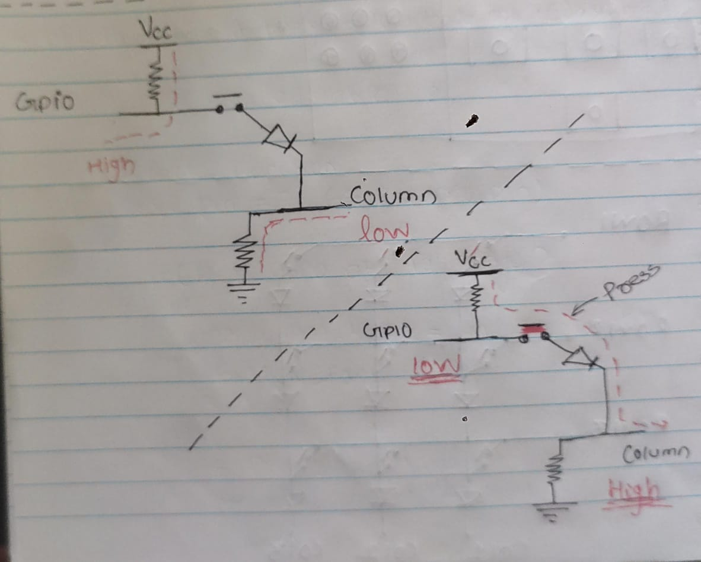
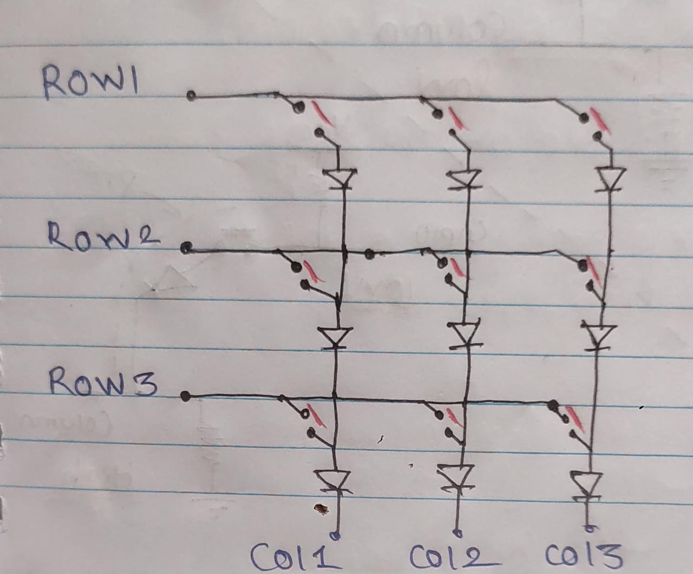
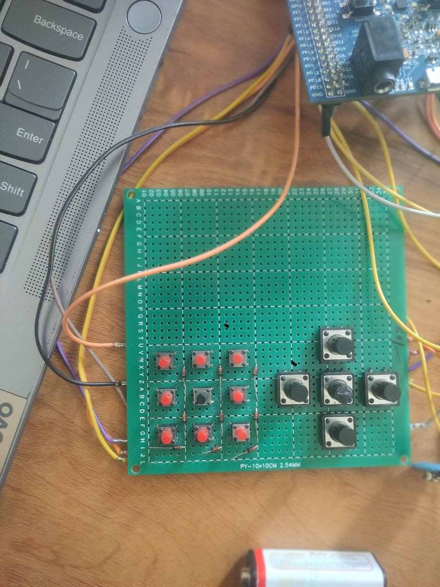
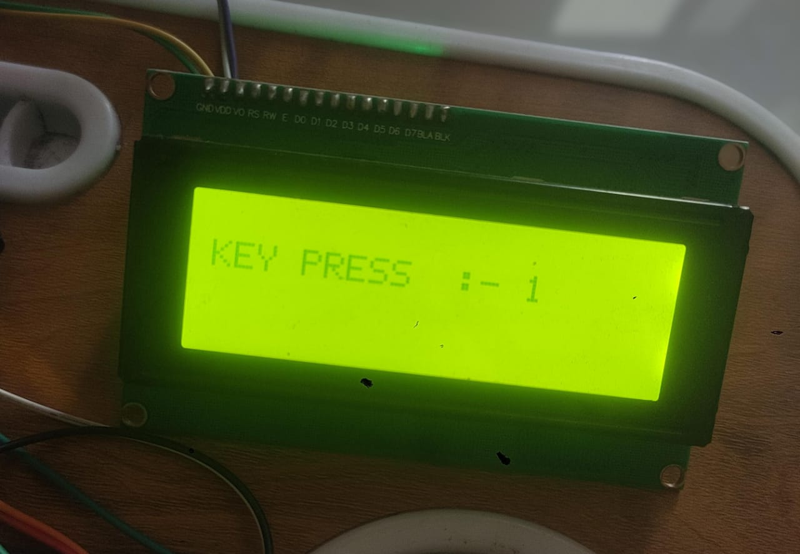
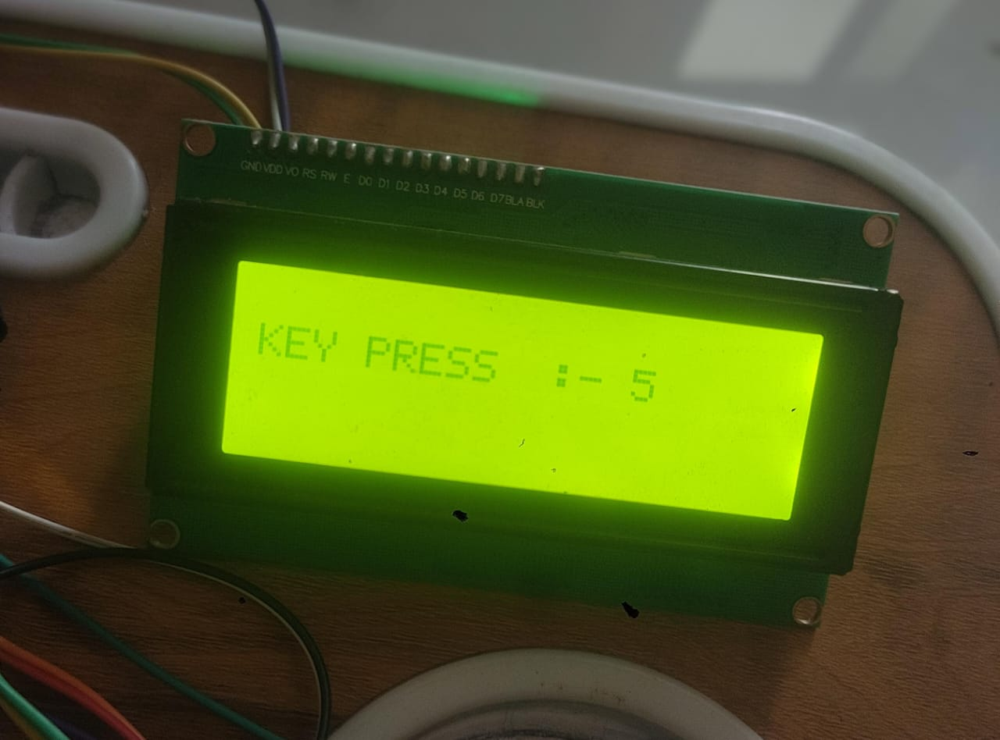

# 🧮 3x3 Key Matrix Keypad (Bare-Metal STM32)

This project provides a lightweight, bare-metal implementation of a 3x3 key matrix keypad using switches and diodes, designed for STM32 microcontrollers. It includes modular `keypad.c` and `keypad.h` files that can be easily integrated into any STM32 project without relying on HAL drivers or CubeMX.

---

## 🔧 Features

- ✅ 3x3 matrix keypad scanning using GPIO
- ✅ Diode-isolated switch design for ghosting prevention
- ✅ Fully bare-metal (no HAL dependency)
- ✅ Simple API: `init_keypad()` and `scan_keypad()`
- ✅ Debouncing-friendly structure
- ✅ Easy to integrate into existing STM32 projects

---

## 📁 File Structure

├── keypad.c    # Core keypad logic 
├── keypad.h    # Function declarations and pin mappings
├── LCD.c/h     # If you are using my lcd library 
├── I2C.c/h     # for LCD 
├── main.c      # Demo code  
├── README.md   # Project documentation

## 🔄 Implementation Flow

This section explains how the 3x3 keypad scanning logic works, including row/column activation, diode isolation, and key detection.

### 🧭 Flow Overview

## FOR ROW (-)
:- set it as output

## FOR COLUMN (|)
:- set it as input 

### 🖼️ Flow Diagram

## Scanning Algorithm
:- Set one row high, other low

void activte_row(uint8_t row)
{
	KEYMATRIX -> ODR &= ~(BV(ROW_1) | BV(ROW_2)| BV(ROW_3));

	KEYMATRIX -> ODR |= BV(row);
}

:- read all colum pins
:- if column read low, a button at that row - column intersetion is pressed

  for(uint8_t row = 0; row < 3 ;row++)
	{
		activte_row(row);
		for(uint8_t col = 0; col < 3;col++)
		{
			if(read_col(col))
					{
						return KEY_MATRIX[row][col];
					}
		}

	}

## 🔄 Implementation Flow

To use the 3x3 keypad module in your STM32 bare-metal project, follow these steps:

### 1. Include the Header

Add the keypad header to your main source file:

#include "KEYPAD.h"

### 2. Initialize the Keypad

init_keypad()

#### 3. get the value from

char button;
button = scan_keypad()

## For Demo

use Main.c file 

here is the output imeages 

